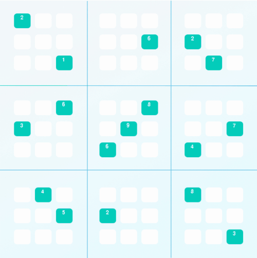

# Solve Sudoku with AI



## 1. Background

This project implements an algorithm to solve _diagonal_ Sudoku puzzles. A diagonal Sudoku puzzle is identical to traditional Sudoku puzzles, but with the added constraint that the boxes on the two main diagonals of the board must also contain the digits 1-9 in each cell (just like the rows, columns, and 3x3 blocks).

## 2. Strategy

The strategies to solve the puzzles are as follow:

- **Naked twins**: If you have two or more unallocated boxes in a unit and there are only two digits that can go in those two boxes, then those two digits can be eliminated from the possible assignments of all other boxes in the same unit.
- **Eliminate:**: If a box has a value assigned, then none of the peers of that box can have the same value.
- **Only choice**: If only one box in a unit allows a certain digit, then that box must be assigned that digit.
- **Depth-first search**: Apply depth first search to solve Sudoku puzzles in order to solve puzzles that cannot be solved by repeated reduction alone

## 3. Installation

```bash
pip install -r requirements.txt
```

## 4. How to use

Running `python solution.py` will automatically attempt to visualize your solution, but you must use the provided `assign_value` function (defined in `utils.py`) to track the puzzle solution progress for reconstruction during visuzalization.
